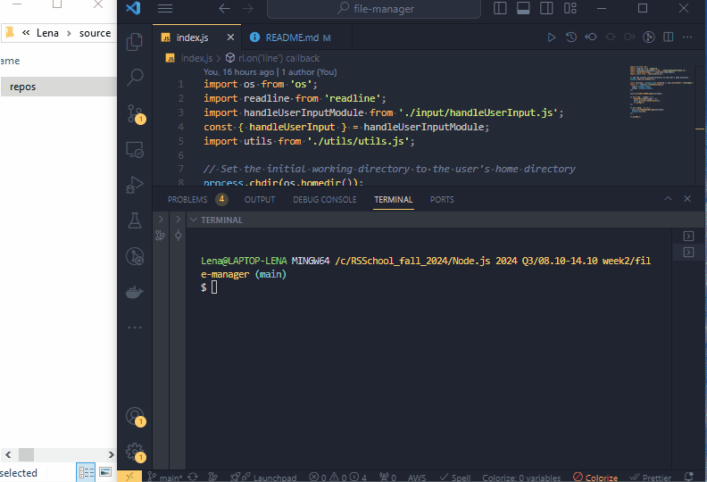

🔔 🔔 🔔
---

# File Manager

This project implements a **File Manager** using Node.js APIs. The File Manager allows you to perform basic file operations, interact with the operating system, calculate file hashes, and handle file compression/decompression.

## Features

- **CLI-based**: Work with the File Manager directly from the command line.
- **Basic File Operations**: Copy, move, delete, rename, and read files.
- **Streams API**: Utilized for file operations such as reading, copying, and compressing files.
- **Operating System Information**: Retrieve information like system EOL, CPU details, home directory, and more.
- **Hash Calculations**: Generate file hashes for integrity checking.
- **File Compression/Decompression**: Use the Brotli algorithm to compress and decompress files.

## Getting Started

### Prerequisites

- **Node.js v22.x.x or above** (Recommended: v22.9.0)
- **npm** installed

### Installation

1. Clone the repository:
  ```
  git clone https://github.com/ElenaCoder/file-manager.git
  cd file-manager
  ```

## Running the File Manager

1. To start the File Manager, use the following command:
  ```
  npm run start -- --username=your_username
  ```
  Replace your_username with your desired username. This username will be displayed in the welcome and exit messages.

2. Example output:
  ```
  Welcome to the File Manager, your_username!
  You are currently in /Users/your_username
  ```

3. To exit the program, type `.exit` or press `Ctrl + C`.

4. Upon exit, you will see a message like:
  ```
  Thank you for using File Manager, your_username, goodbye!
  ```

## File Manager Operations

<details>
<summary>Navigation & Working Directory (nwd)</summary>

#### Go upper from current directory.
  - **Command**: `up` - moves one directory up (except when in the root directory).

#### Change to dedicated folder.
  - **Command**: `cd path_to_directory` - changes the working directory to the specified path. The path can be relative or absolute.

#### List all files and folders in the current directory.
  - **Command**: `ls`- prints the list of files and directories. The output is sorted with directories listed first, followed by files.

</details>

<details>
<summary>Basic File Operations</summary>

#### Read a file's content
  - **Command**: `cat path_to_file` - reads and prints the content of the specified file.

#### Create a new file
  - **Command**: `add new_file_name` - creates an empty file with the specified name.

#### Rename a file
  - **Command**: `rn path_to_file new_filename` - renames the specified file while keeping its content unchanged.

#### Copy a file
  - **Command**: `cp path_to_file path_to_new_directory` - copies the file to the specified directory using readable and writable streams.

#### Move a file
  - **Command**: `mv path_to_file path_to_new_directory` -moves the file to the new directory (same as copy, but deletes the original file).

#### Delete a file
  - **Command**: `rm path_to_file` - deletes the specified file.

</details>

<details>
<summary>Operating System Info</summary>

#### Get system End-Of-Line (EOL)
  - **Command**: `os --EOL` - prints the system's default EOL.

#### Get CPU information
  - **Command**: `os --cpus` - displays the number of CPUs, as well as each CPU's model and clock rate (in GHz).

#### Get home directory
  - **Command**: `os --homedir` - prints the user's home directory.

#### Get current system user name
  - **Command**: `os --username` - prints the current system's user name (not the username passed at the start).

#### Get CPU architecture
  - **Command**: `os --architecture` - prints the CPU architecture for which Node.js binary was compiled.

</details>

<details>
<summary>Hash Calculation</summary>

#### Calculate hash for a file
  - **Command**: `hash path_to_file` - computes and prints the hash for the specified file.

</details>

<details>
<summary>Compression & Decompression</summary>

#### Compress a file
  - **Command**: `compress path_to_file path_to_destination` - compresses the specified file using the Brotli algorithm and streams, saving the result in the destination.

#### Decompress a file
  - **Command**: `decompress path_to_file path_to_destination` - decompresses the previously compressed file using the Brotli algorithm, ensuring the result matches the original file.

</details>

<details>
<summary>Error Handling</summary>

- In case of invalid commands or missing/incorrect arguments, the File Manager will print `Invalid input` and wait for the next command.

- If an operation fails (e.g., trying to work on a non-existent file), the message `Operation failed` will be printed, and the user can enter another command.

</details>


## Project preview

Explore a sneak peek of the File Manager Navigation features with this animated GIF.

